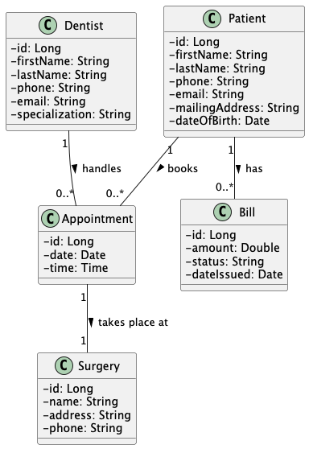

# Lab 2 – Functional Requirements
**Course:** CS489 – Applied Software Development  
**Author:** Arif Rahman  
**Company:** Advantis Dental Surgeries (ADS)  
**Date:** April 2025

## Functional Requirements

[//]: # (1. The Office Manager can register new Dentists in the system.)

[//]: # (2. Each Dentist must have a unique ID, first name, last name, phone number, email, and area of specialization.)

[//]: # (3. The Office Manager can register new Patients with details including full name, contact phone number, email, mailing address, and date of birth.)

[//]: # (4. Patients can request appointments either by phone or through an online form.)

[//]: # (5. The Office Manager can book appointments and the system will automatically send confirmation emails to patients.)

[//]: # (6. The system records each appointment with a scheduled date, time, dentist, patient, and surgery location.)

[//]: # (7. Dentists can log in to the system and view a list of all their upcoming appointments along with patient details.)

[//]: # (8. Each Surgery must have a name, address, and phone number stored in the system.)

[//]: # (9. Patients can log in to the system and view their scheduled appointments including the assigned dentist.)

[//]: # (10. Patients should be able to request to cancel or reschedule appointments.)

[//]: # (11. The system must prevent a dentist from having more than 5 appointments in a single week.)

[//]: # (12. The system must block appointment requests from patients who have any unpaid bills.)

[//]: # (13. Each Patient may have one or more bills linked to services they've received, including bill amount, date, and payment status.)

[//]: # ()
[//]: # (---)

---

## User Roles

1. **Office Manager (Admin)** – Responsible for managing the system, registering users, and booking appointments.
2. **Dentist** – Provides dental services and manages their own schedule.
3. **Patient** – Receives services, books appointments, and manages their bills.

---

## Dentist Features

- Dentists can log in to the system.
- Dentists can view a list of their upcoming appointments.
- Each appointment includes patient details, date, time, and surgery location.
- Dentist **Business Rules**
  - A dentist **cannot have more than 5 appointments per week**.
  - Dentists must have:
      - Unique ID
      - First name and last name
      - Contact phone number
      - Email address
      - Area of specialization

---

## Patient Features

- Patients can request appointments:
    - By phone (through Office Manager)
    - Via online form on the ADS website
- Patients can log in to view their upcoming appointments.
- Patients can request to **cancel or reschedule** an appointment.

- Patient **Business Rules**
  - Patients must have:
      - First name and last name
      - Contact phone number
      - Email
      - Mailing address
      - Date of birth
  - Patients **cannot request new appointments** if they have an **unpaid bill**.

---

## Office Manager (Admin) Features

- Can register new Dentists into the system.
- Can enroll new Patients into the system.
- Can book appointments between patients and dentists.
- Can view all surgeries and manage surgery-related data.
- System should automatically send a confirmation email upon successful appointment booking.

---

## Surgery Management

- The system must store details of each Surgery, including:
    - Surgery name
    - Location address
    - Contact phone number

---

## Appointment Management

- Each appointment must include:
    - Date and time
    - Assigned dentist
    - Assigned patient
    - Surgery location

---

## Billing Rules

- Each patient may have multiple bills for received services.
- Each bill includes:
    - Amount
    - Issue date
    - Payment status (paid/unpaid)
- Patients **with unpaid bills** should be restricted from booking new appointments.

---

## Domain Model Diagram

