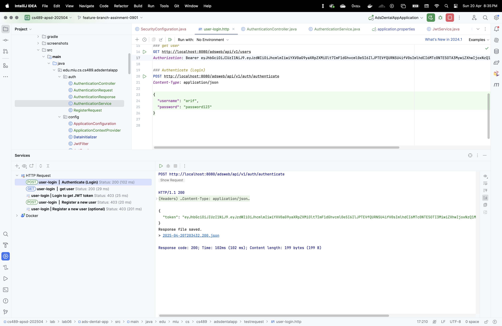

# ADS Dental Appointments Management System

This is a Spring Boot application developed as part of the **CS489** course **Lab 06** for managing operations in the **ADS Dental Surgeries** network. It includes features for handling:

- Patients
- Dentists
- Dental Surgeries
- Appointments
- Users & Roles (for system access)

---

## Technologies Used

- Java 21
- Spring Boot
- Spring Data JPA
- PostgreSQL
- MapStruct
- Lombok
- Swagger / OpenAPI
- Gradle (Build Tool)

---

## Features

- Full CRUD operations for all entities
- Clean DTO ↔ Entity mapping using MapStruct
- Optional-based service structure for safer null handling
- Swagger UI for API exploration
- Modular project structure following best practices

---
### PostgreSQL Setup

Create a database named `adsdentaldb`:

```sql
CREATE DATABASE adsdentaldb;
```

#### Update your DB credentials in src/main/resources/application.properties:

properties
```
spring.datasource.username=your_db_username
spring.datasource.password=your_db_password
```


### Swagger / OpenAPI Docs
Once the app is running, visit:

Swagger UI: http://localhost:8080/swagger-ui.html

OpenAPI JSON: http://localhost:8080/v3/api-docs

You can also import this into Postman via link/copy-paste the json.


## Screenshots

### 01. List all Patients


### 02a. View Patient by ID


### 02b. View Patient - Not Found Error


### 3a. Register a new patient (valid)


### 3b. Register a patient (invalid address)


### 4a. Update patient by valid ID


### 4b. Update patient by invalid ID


### 5a. Delete patient by valid ID


### 5b. Delete patient by invalid ID


### 6a. Search patients (match)


### 6b. Search patients (no match)


### 7. Get all addresses (sorted by city)


